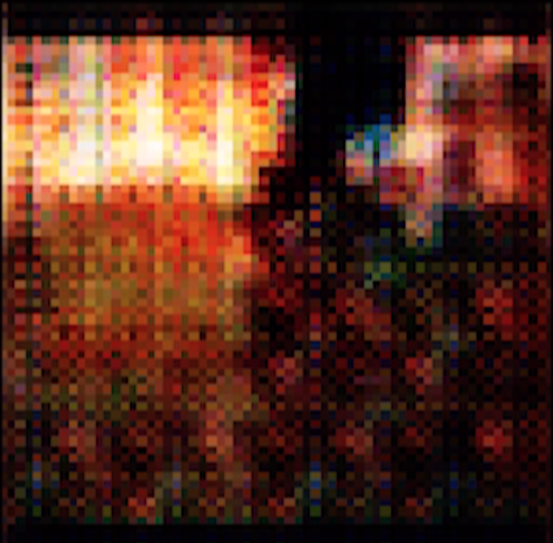

### MSc Creative Computing, Coding 2: Advanced Frameworks
# Final Project - Aleksi Halttunen

## LINKS TO ART (video)
## **'Three studies on fear'**
### 1/3 https://vimeo.com/408648734  
### 2/3 https://vimeo.com/408652449  
### 3/3 https://vimeo.com/408653010

## FOLDER DIRECTORY
**/dataGeneration.ipynb**  
Code used for data collection; collecting pictures from video frames (and manipulating them if needed).  Any type of video can be used.
  
**/DCGANwithVideoOutput.ipynb**  
DCGAN model that outputs latent space interpolation video. Run on Google Colab https://colab.research.google.com/notebooks/intro.ipynb# with the runtime set to GPU (Runtime -> Change runtime type -> Hardware Accelerator: GPU).

## BACKGROUND
This three-part piece explores the visual aesthetics of horror with the help of a generative neural network. I used horror film scenes as input in an attempt to capture how 'cold' computational tools can help interpret and reimagine the aesthetics of something untangible and subjective - fear.  

Specific input scenes were chosen with two requirements in mind: for being particularly terrifying and maintaining some sort of interesting visual aesthetic throughout. I hypothesised early on that a constant colour scheme was essential in outputting interesting and consistent outcomes. 

'1/3' uses the ending scene to 'The Texas Chain Saw Massacre' (1974) by director Tobe Hooper, '2/3' uses the climatic ballet scene from 'Black Swan' (2010) by director Darren Aronofsky, and '3/3' uses the gory eyeball scene from 'The Neon Demon' (2016) by director Nicolas Winding Refn. All of the clips used for input data were around 10-30 seconds long. 

  
*Figure: Stills from the movie scenes used as input data*

The code used to generate these videos is in two parts. The first notebook, dataGeneration.ipynb, is used for extracting the picture frames from the input videos. Also, for '1/3' I mirrored each of the frames horizontally to generate more input data, and the code used to do that is included in this file as well. The second python notebook file, DCGANwithVideoOutput.ipynb, is used in training the model with the input data and generating the latent space frames and outputting the videos. 

  
*Figure: A set of frames extracted from video clips*

This project utilises a DCGAN (Deep Convolutional Generative Adversarial Network), which consists of two main functions. The 'generator' generates data (initially just random noise in the form of a picture pulled from a normal distribution in our case). The 'discriminator' looks at images generated by the generator and tries to determine whether they match the input data. This proces of backpropagation is iterated until the loss function output is minimised and the generator 'learns' to produce new images as statistically close to the original input images as possible (the normal distribution we pull randomised images from is shaped to represent the 'actual' distribution of the dataset).

First I played around with some 64x64 DCGAN found on the internet to get used to the process. I used the Chain Saw Massacre scene as input and outputted some very low resolution and quite uninteresting frames. I knew I wanted higher quality, so I looked at multiple higher quality DCGANs out there. 

  
*Figure: Initial low-resolution single output image*

I found this great tutorial for building a DCGAN for 256x256 output here: https://www.ritchievink.com/blog/2018/07/16/generative-adversarial-networks-in-pytorch-the-distribution-of-art/. This was perfect because on Google Colab, having any higher output would mean ridiculously long training times, and I wanted to be able to go back and fine-tune the algorithm in case I was not happy with the outcome. 

Having had only little practical experience with machine learning models, I had to dig much deeper than in class, and ultimately try many different approaches, but learning a lot along the way. As I did not have the expertise to develop the actual model myself, the most difficult part of my project had to with the logistics around it, choosing and preparing the data, getting the provided model code to run on Google Colab (the code was written for CUDA), and then wrapping my head around how latent space interpolation works in practice.  

I ended up using a simple linear interpolation (instead of more sophisticated options like SLERP), where I took two input tensors, and made every element in one of these tensors change linearly to the corresponding elements in the other. 100 frames were generated of this gradual change for the latent space between 8 randomly generated input tensors, resulting in 800 input tensors for the generator, ultimately generating a looping latent space interpolation video of 800 frames, at 30 frames per second (this was later sped up for aesthetic reasons).

  
*Figure: eight images from the generator by randomly generated tensors used later for latent space interpolation.*

I had already mirrored the data in an attempt to double the training dataset size for the chainsaw massacre clip, as it was only 12 seconds long. Upon deploying my video extractor, it extracted multiple instances of the same image.  I was very aware that duplicating data is frowned upon in the field of statistics and data science. Inputting the same dataset multiple times can easily lead to overfitting the model. However in my head I liked this idea - an overfitted model could result in an abstract, yet familiar outcome. As the goals of my project already weren't in line with how machine learning models are traditionally thought of being used, I saw this as an opportunity of using the idea of 'knowing the rules and then breaking them' to my advantage. This worked beautifully and I really liked the outcomes that it produced. 

Creative input was present in many parts of the project.
I structured the code in a way that allows the artist to 'direct' the outcome of the latent space interpolation video. You have control over the order in which you want certain points in the latent space to occur. If I did not like a certain output image, I could just 're-shuffle' the initiating tensor until the generator produced an output I was pleased with. This process lets you view the algorithm as an artistic tool, no different from a paintbrush or a camera. I look forwrd to gaining a deeper understanding of these machine learning tools and their potential applications and capabilities, and learning to develop my own models in the future. 

